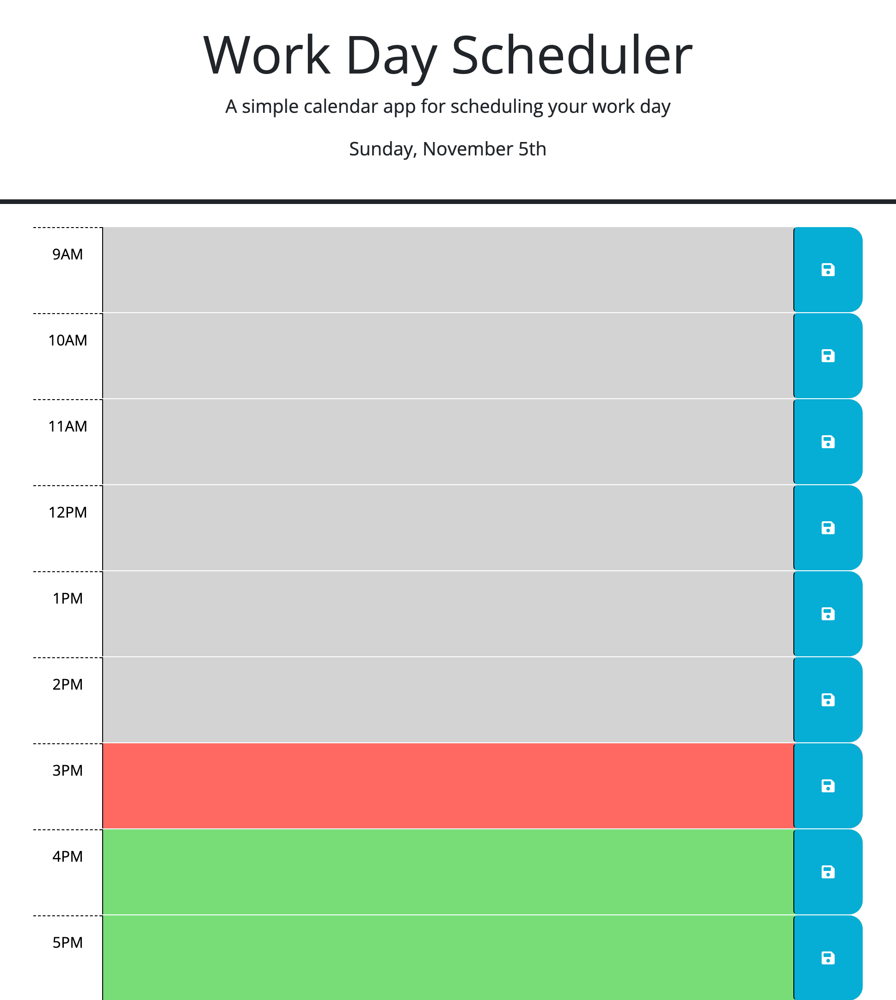

# Work Day Scheduler

## Description

In this application I added functionaility to an existing appilcation using Third Party APIs. The appilcation is a work day scheduler that tracks the time, date, and items that are scheduled each hour throughout a work day. The work day sch in the day. The date is also tracked through the Day.js API as well and displayed at the bottom of the header. Lastly you can also save data inputed into a time block to local storage so that you can see it again when you return to the web appilcation.

### Take-Aways

- My motivation for this project was to expand my knowledge of third party APIs such as jQuery, Bootstrap, and Day.js.

- The problem my work day scheduler solved was that it helps employees organize and track their work day schedule.

- I learned about third party APIs such as jQuery, Bootstrap, and Day.js.

## Usage

This appilcation is a work day scheduling program.

- You are able to fill in the text area for the given hour with a task or set of tasks.
    - You can always save the data inserted in the text area as well.

**[Deployed Application](https://kpierce236.github.io/Work-Day-Scheduler/)**

### Screenshot of Application

## Credits

## Third-Party Assets

- [Bootstrap](https://getbootstrap.com/)
- [jQuery](https://jquery.com/)
- [Day.js](https://day.js.org/en/)

### Tutorials

- [MDN web docs](https://developer.mozilla.org/en-US/docs/Web/JavaScript)
- [Writing a README](https://coding-boot-camp.github.io/full-stack/github/professional-readme-guide)

## License

Please refer to license in the repo.